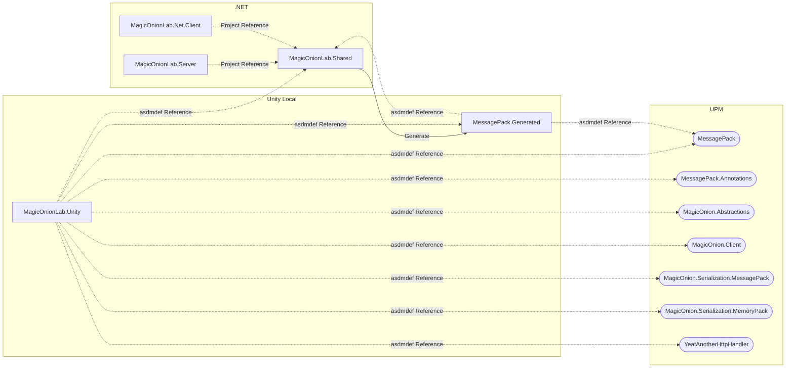

# MagicOnion-lab

[Cysharp/MagicOnion](https://github.com/Cysharp/MagicOnion) lab.

# Architecture

## Project Reference

Referencing between .NET csproj is using [Project Reference](https://learn.microsoft.com/ja-jp/dotnet/core/tools/dotnet-add-reference). However Unity does not support Project Reference. Therefore Unity project reference is using [Unity Package Manager (a.k.a UPM)](https://docs.unity3d.com/2019.4/Documentation/Manual/Packages.html) with local file `package.json`. Also Unity's external assembly refernce is resolved with [assembly definition file(a.k.a asmdef)](https://docs.unity3d.com/2018.4/Documentation/Manual/ScriptCompilationAssemblyDefinitionFiles.html).



## Unity Package Structure


# List of projects

## .NET Shared

* [x] src/MagicOnionLab.Shared: .NET Shared with Service/Hub and MessagePack object

## .NET Server

* [x] src/MagicOnionLab.Server: .NET Server

## Client

.NET

* [x] src/MagicOnionLab.Net.Client: .NET Client

Unity

* [x] src/MagicOnionLab.Unity: Windows Unity Client (Mono)
* [x] src/MagicOnionLab.Unity: Windows Unity Client (IL2CPP)
* [ ] src/MagicOnionLab.Unity: Linux Unity Client (Mono)
* [ ] src/MagicOnionLab.Unity: Linux Unity Client (IL2CPP)
* [ ] src/MagicOnionLab.Unity: macOS Unity Client (Mono)
* [ ] src/MagicOnionLab.Unity: macOS Unity Client (IL2CPP)
* [ ] src/MagicOnionLab.Unity: Android Unity Client (Mono)
* [ ] src/MagicOnionLab.Unity: Android Unity Client (IL2CPP)
* [ ] src/MagicOnionLab.Unity: iOS Unity Client (Mono)
* [ ] src/MagicOnionLab.Unity: iOS Unity Client (IL2CPP)

# FAQ

## Unity Project

.NET Standard 2.1 is supported from MagicOnion v6.

## Unity - How to install MagicOnion and related packages.

* Use NuGetForUnity to install dlls from NuGet.
* Use OpenUPM to install MessagePack for C#.
* Use UPM to install YetAnotherHttpHandler, MagicOnion.

## Unity - How to install MageicOnion Shared project to Unity by Pacakge Manager

Unity can reference Shared by Package Manager. You need to create `package.json` and `asmdef` manually, add MessagePack Generator & MagicOnion Generator, and adjust bin/obj output. Let's say Sahred csproj as `MagicOnionLab.Shared` and Unity project as `MagicOnionLab.Unity`. Then you need to do following.

1. Create `package.json`
  You need create package.json in `MagicOnionLab.Shared/package.json`. package.json defines `package name` and displa name. Make sure `displayName` should be same as asmdef definition.

  ```json
  {
    "name": "com.guitarrapc.magiconionlab.shared.unity",
    "version": "1.0.0",
    "displayName": "MagicOnionLab.Shared.Unity",
    "description": "MagicOnionLab.Shared.Unity",
    "unity": "2022.1"
  }
  ```

2. Create `asmdef`
  You need create asmdef in `MagicOnionLab.Shared/MagicOnionLab.Shared.asmdef`. asmdef defines `namd`, `references` and`autoReferenced`. Make sure `name` should match `displayName` in package.json. Also reference should resolve dependencies pacakges to MagicOnion and MessagePack, this is key point.

  ```json
  {
    "name": "MagicOnionLab.Shared.Unity",
    "references": [
        "MessagePack.Annotations",
        "MagicOnion.Abstractions"
    ],
    "optionalUnityReferences": [],
    "includePlatforms": [],
    "excludePlatforms": [],
    "allowUnsafeCode": false,
    "overrideReferences": false,
    "precompiledReferences": [],
    "autoReferenced": true,
    "defineConstraints": []
  }
  ```

3. Add MessagePack Generator
  You nedd add dotnet tools to generate MessagePack object. You can add it by following commands.

  ```sh
  dotnet tool install MessagePack.Generator
  ```

  Modify Shared csproj `MagicOnionLab.Shared.csproj` to run MessagePackage Generator on build.

  ```xml
  <Target Name="RestoreLocalTools" BeforeTargets="GenerateMessagePack;GenerateMagicOnion">
    <Exec Command="dotnet tool restore" />
  </Target>

  <Target Name="GenerateMessagePack" AfterTargets="Build">
    <PropertyGroup>
      <_MessagePackGeneratorArguments>-i ./MagicOnionLab.Shared.csproj -o ../MagicOnionLab.Unity/Assets/Scripts/Generated/MessagePack.Generated.cs</_MessagePackGeneratorArguments>
    </PropertyGroup>
    <Exec Command="dotnet tool run mpc $(_MessagePackGeneratorArguments)" />
  </Target>
  ```

5. Adjust bin/obj output

  bin/obj is special folder for .NET on build. However these folder conflict on reference Shared csproj in Unity. Therefore you need to adjust output folder to avoid conflict. You can do it by following.

  Add following `MagicOnionLab.Shared/Directory.Build.targets`.

  ```xml
  <?xml version="1.0" encoding="utf-8"?>
  <Project xmlns="http://schemas.microsoft.com/developer/msbuild/2003">
    <!-- Hide Unity-specific files from Visual Studio and .NET SDK -->
    <ItemGroup>
      <None Remove="**\package.json" />
      <None Remove="**\*.asmdef" />
      <None Remove="**\*.meta" />
    </ItemGroup>

    <!-- Hide build artifacts from Visual Studio and .NET SDK -->
    <ItemGroup>
      <None Remove=".artifacts\**\**.*" />
      <None Remove="obj\**\*.*;bin\**\*.*" />
      <Compile Remove=".artifacts\**\**.*" />
      <Compile Remove="bin\**\*.*;obj\**\*.*" />
      <EmbeddedResource Remove=".artifacts\**\**.*" />
      <EmbeddedResource Remove="bin\**\*.*;obj\**\*.*" />
    </ItemGroup>
  </Project>
  ```

  Add Directory.Build.props to `MagicOnionLab.Shared/Directory.Build.props`.

  ```xml
  <?xml version="1.0" encoding="utf-8"?>
  <Project xmlns="http://schemas.microsoft.com/developer/msbuild/2003">
      <!--
      Override the output path of build artifacts.
      This is necessary to change the path to one with a dot(.) prefix to hide generated items from Unity.
    -->
    <PropertyGroup>
      <!-- Using .NET 8 and later, use ArtifactsPath property. -->
      <!-- https://learn.microsoft.com/en-us/dotnet/core/sdk/artifacts-output -->
      <ArtifactsPath>$(MSBuildThisFileDirectory).artifacts</ArtifactsPath>
      <!-- Using .NET 7 and ealier, use BaseIntermediateOutputPath and BaseOutputPath property instead. -->
      <!-- NOTE: Currently, even if .NET 8 SDK is installed, MessagePack.Generator still requires these properties to be set. -->
      <BaseIntermediateOutputPath>.artifacts\obj\</BaseIntermediateOutputPath>
      <BaseOutputPath>.artifacts\bin\</BaseOutputPath>
    </PropertyGroup>
  </Project>
  ```
